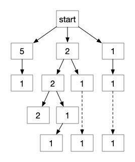
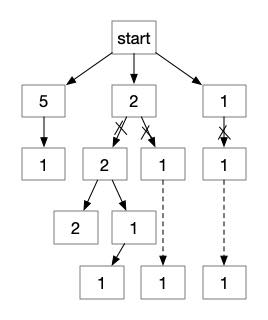

### Question

You are given coins of different denominations and a total amount of money *amount*. Write a function to compute the fewest number of coins that you need to make up that amount. If that amount of money cannot be made up by any combination of the coins, return `-1`.

**Example 1:**

```
Input: coins = [1, 2, 5], amount = 11
Output: 3 
Explanation: 11 = 5 + 5 + 1
```

**Example 2:**

```
Input: coins = [2], amount = 3
Output: -1
```

**Note**:
You may assume that you have an infinite number of each kind of coin.

### Solution

#### S1:动态规划

已知可选数组 coins ，选择其中最少个数（可重复选择），使得其和为 amount 。

假设这样一个最优解，所选择的数字的序列是`[n1,n2,...,nn]`，也就是说这个最优解序列中的最后一个数一定也是包含在 coins 里面的，那么求和为 amount 的最优解，就变成了求 amount-nn 的最优解，又因为的 nn 是 coins 其中的一个，遍历 coins 就可以找出这个 nn 。

于是求解 amount 变成了求解 amount-nn ，同理，amount-nn 也可以利用相同的办法分解成更小的数。公式如下：

```java
amount的解 = min(amount - ni 的解) // ni 是 coins 中的所有元素
```

所以可以得到代码：

```java
public static int coinChange(int[] coins, int amount) {
    int[] saved = new int[amount+1];
    Arrays.fill(saved, Integer.MAX_VALUE);
    saved[0] = 0;
    for (int i = 1; i <= amount; i++) {
        for (int coin : coins) {
            if (i >= coin && saved[i-coin] < saved[i]-1) {
                saved[i] = saved[i-coin] + 1;
            }
        }
    }
    return saved[amount] == Integer.MAX_VALUE ? -1 : saved[amount];
}
```

这种方法也可以换成相应的递归求解，如下：

```java
public static int coinChange(int[] coins, int amount) {
    int min = min(coins, amount, new int[amount+1]);
    return min == Integer.MAX_VALUE ? -1 : min;
}
private static int min(int[] coins, int left, int[] saved) {
    if (left == 0) return 0;
    if (saved[left] != 0) return saved[left];
    int min = Integer.MAX_VALUE;
    for (int coin : coins) {
        if (left >= coin) {
            min = Math.min(min, min(coins, left-coin, saved));
        }
    }
    if (min == Integer.MAX_VALUE) {
        saved[left] = min;
        return min;
    }else {
        saved[left] = min+1;
        return min+1;
    }
}
```

#### S2:递减选择

如果要达到选择最少的数，使其和为 amount 这一目标，那么一种想法是数值较大的数选择的越多越好，在选择的时候，应该先选择 coins 数组中最大的数，然后选择次大的数…… 那就应该先对 coins 这个数组排序。完了之后，我们的想法是先选择最大的那个数，可是如何判断该选择多少？

假如这个最大的数是 nn ，那选择 nn 的最大次数应该是 amount/nn ，再多的话就比 amount 大了，但是也不一定一定要选择最多的次数，甚至不一定要选择这个最大的数。此时 amount 还剩余`left = amount - amount/nn \* nn`。

接着以相同的方式判断此大的数，直到 coins 数组中所有的数都判断完了即可。如下：

```java
public static int coinChange(int[] coins, int amount) {
    Arrays.sort(coins);
    return min(coins, coins.length-1, amount);
}
private static int min(int[] coins, int pos, int left) {
    int coin = coins[pos];
    if (pos == 0) {
        if (left % coin == 0) {
            return left / coin;
        }
    } else {
        int min = -1;
        for (int i = left/coin; i >= 0; i--) {
            int m = min(coins, pos-1, left - i*coin);
            if (m != -1 && (m < min-i || min == -1)) {
                min = m+i;
            }
        }
        return min;
    }
    // pos = 0 ，表示只剩下一个数了，但是这个数并不能组成剩余的 left ，故无解
    return -1;
}
```

这种解法会有很多的重复计算，比如最大的数 nn 是次大的数 nn-1 的两倍，那么就需要重复计算 amount-nn 与 amount-2*(nn-1) 的解。一般情况下，多是使用一个缓存数组，将某种已经计算过的情况的解保存下来，当需要重复计算的时候，只需要从缓存中取解，上面一种方法的递归求解，就是采用类似的方法。

本题也可以采用一种更简单的方法，因为我们要求的是一个最优解，在求解的过程中，如果可以判断在当前这种情况下求出的解一定会大于已知的最优解（如当前的 left 还不是 0 ，所得解就已经大于已知最优解），可以直接抛弃这种情况，如下：

```java
private static int result;
public static int coinChange4(int[] coins, int amount) {
    result = Integer.MAX_VALUE;
    Arrays.sort(coins);
    min(coins, amount, coins.length-1, 0);
    return result == Integer.MAX_VALUE ? -1 : result;
}
private static void min(int[] coins, int left, int pos, int res) {
    int coin = coins[pos];
    if (pos == 0) {
        if (left % coin == 0) {
            result = Math.min(result, left/coin + res);
        }
    } else {
        for (int i = left / coin; i >= 0 && res + i < result; i--) {
            min(coins, left - i*coin, pos-1, res + i);
        }
    }
}
```


比较一下这两种方法，上一种通过`if (saved[left] != 0)`，可以求出已经缓存过的解，而这种方法中，使用`res + i < result`将非最优解的情况直接剪去，它们本身来说都算是一种优化方法：用空间换取时间。

这两种方法有什么区别？对于上面那种动态规划的方法，我们知道动态规划一般都需要一个数组保存已经计算过的部分解，然后利用这些解再求取新的解，即之所以能使用动态规划，有三个条件：

1.  能够明确地找出解的状态，并能够确定要求的解就是这些状态中一个解
2.  能够明确每个状态都有一个唯一解，状态与对应的解对应
3.  一个状态下的解能够使用另一个状态的解简化计算

对于本题来说，数组`[1,...,amount]`就是这些状态，每个状态（如 i ），都会有一个最优解，并且 i 状态的解 +1，肯定也是 i+coins[x] 状态的最优解，相应的，对于递归算法来说，amount 状态的解，可以是 amount-4 状态的解 +1 ，也可以是 amount-2-2 状态的解 +2 ，它们都会使用到 amount-4 状态的解，如果只是简单的递归算法的话，它们的求解过程会有一部分重合，所以，使用缓存的目的就是为了避免重复计算。

但是这种方法有一定的条件，就是对于每一个状态都需要一个缓存值，换言之就需要一段缓存空间，如果状态数太多的话，就需要花费很多的空间，就像上面的解 2 一样，这样一个递归算法，有多少状态？首先，它有一个剩余数字 left ，还有一个当前位置 pos ，也就是说，它有`amount * coins.length`个状态，解法 2 其实也可以改成缓存的方式：

```java
public static int coinChange(int[] coins, int amount) {
    Arrays.sort(coins);
    return min(coins, amount, coins.length-1, new int[amount+1][coins.length]);
}
private static int min(int[] coins, int left, int pos, int[][] saved) {
    if (saved[left][pos] != 0) return saved[left][pos];
    int coin = coins[pos];
    if (pos == 0) {
        if (left % coin == 0) {
            return left / coin;
        }
    } else {
        int min = Integer.MAX_VALUE;
        for (int i = left/coin; i >= 0; i--) {
            int m = min(coins, left - i*coin, pos-1, saved);
            if (m >= 0 && m+i < min) {
                min = m+i;
            }
        }
        saved[left][pos] = (min == Integer.MAX_VALUE ? -1 : min);
        return saved[left][pos];
    }
    return -1;
}
```

但是这种情况下，状态数实在是太多了，也并不太能很好地解决问题，相比较解法 1 只有 amount 种状态的情况，这里的 amount*coins.length 种状态，在实际解题中重合的并不是太多，也就是不能减少太多的重复计算，所以对于效率提升上来说，也没有那么明显。

所以解法 2 使用的是剪枝。下图是`[1,2,5], 6`的解空间树，从根结点 start 开始，该树的每一条路径都是一种求解，而该路径的深度就是该种情况的解，完整列出来就是这样。



如果第一次，我们找到了`[5,1]`这条路径，得到它的深度是 2 ，那么在后续的搜索中，一旦搜索到了第二层，就可以结束了（因为只有深度为 1 的路径才有意义）。此时解空间树变成了：



通过剪枝，叉号下面的那些解就可以不需要判断了。

在什么情况下可以使用这种方法？我觉得应该有这几个条件：

1.  问题的解能够构成解空间树，每条路径是一个解
2.  对于每一个解，不需要判断到叶子结点，就可以根据已知的信息判断该路径构成的解是否符合条件/是否需要继续判断下去

