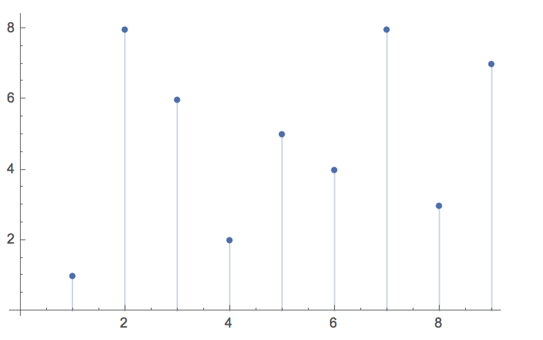

Given *n* non-negative integers *a1*, *a2*, ..., *an*, where each represents a point at coordinate (*i*, *ai*). *n* vertical lines are drawn such that the two endpoints of line *i* is at (*i*, *ai*) and (*i*, 0). Find two lines, which together with x-axis forms a container, such that the container contains the most water.

Note: You may not slant the container and *n* is at least 2.

### Solution

本题有两种解决方法：

1.  穷举法
2.  指针法

#### 穷举

穷举即从对于数组中的每一个数字，都要计算它与它之后的任何一个元素构成的面积，然后找到最大的那一个，这种方法的时间复杂度是$O(n^2)$；

```java
public static int maxArea(int[] height) {
    int max = 0;
    int len = height.length;
    for (int i = 0; i < len - 1; i++) {
        for (int j = i + 1; j < len; j++) {
            int w = j - i;
            int h = Math.min(height[i], height[j]);
            int area;
            if ((area = w * h) > max) {
                max = area;
            }
        }
    }
    return max;
}
```


#### 指针

对于如题所述的一个数组中的任意两个元素构成的面积而言，如下例：

```
1 8 6 2 5 4 8 3 7
```

有对应的：



在使用穷举法的时候，解题的思路是，对于一个每一个 i ，求与之构成面积最大的 j ，也就是构成的矩形的起始点固定，求面积最大的结束点，所以有了 i 从 0 到 n-1 的遍历，那么换个思路：对于每一个 j-i ，保证 j > i ，求构成面积最大的 i 和 j ，也就是宽度一定的时候，求构成的面积最大的矩形在坐标轴上的位置，如果仅仅采用这样一种思路的话，还是避免不了时间复杂度$O(n^2)$的结果，一个理想的思路是，只需要遍历宽度，然后在固定宽度的时候它的最大面积只需要一步就可以判断出来，可以分为两种情况：

1.  能够求出其最大面积，与当前求出的最大面积比较
2.  不能求出最大面积，但是能够肯定它的最大面积小于目前已知的最大面积，直接略过

如果能够找到这样一种理想的计算方法，就可以使它的时间复杂度达到$O(n)$，首先对于宽度为 n 的矩形而言，它只有一种取值，即 i 取最小，j 取最大，那么其面积很容易求得。接下来是求宽度为 n-1 的矩形对应的 i 和 j 的值，可以将其理解为 i 往后移或者 j 往前移，有这两种取值，对应着这么几种情况：

|          | i++<br />h[i] >= h[j]<br />h[i] >= h[i+1] | i++<br />h[i] >= h[j]<br />h[i] < h[i+1] | i++<br />h[i] <  h[j]<br />h[i] >= h[i+1] | i++<br />h[i] < h[j]<br />h[i] < h[i+1] | j--<br />h[i] > h[j]<br />h[j] >= h[j-1] | j--<br />h[i] > h[j]<br />h[j] < h[j-1] | j--<br />h[i] <= h[j]<br />h[j] >= h[j-1] | j--<br />h[i] <= h[j]<br />h[j] < h[j-1] |
| :------: | :---------------------------------------: | :--------------------------------------: | :---------------------------------------: | :-------------------------------------: | :--------------------------------------: | :-------------------------------------: | :---------------------------------------: | :--------------------------------------: |
| 高度变化 |                不变或减小                 |                   不变                   |                不变或减小                 |                  增加                   |                不变或减小                |                  增加                   |                不变或减小                 |                   不变                   |
| 面积变化 |                   减小                    |                   减小                   |                   减小                    |                 不确定                  |                   减小                   |                 不确定                  |                   减小                    |                   减小                   |

所以，只有当这两种情况`h[i] < h[j],i++`、`h[j] < h[i], j--`出现的时候，才需要计算其面积以判断是否大于当前的最大面积。

另外，可以确定的是，如果某个宽度的

所以代码为：

```java
public static int maxArea(int[] height) {
    int max = 0;
    int len = height.length;
    int l = 0, r = len - 1;
    while (l < r) {
        max = Math.max(max, Math.min(height[l], height[r]) * (r - l));
        if (height[l] < height[r]) {
            l++;
        }else {
            r--;
        }
    }
    return max;
}
```