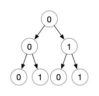
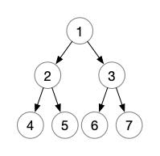

### Question

Given a non negative integer number **num**. For every numbers **i** in the range **0 ≤ i ≤ num** calculate the number of 1's in their binary representation and return them as an array.

**Example 1:**

```
Input: 2
Output: [0,1,1]
```

**Example 2:**

```
Input: 5
Output: [0,1,1,2,1,2]
```

**Follow up:**

-   It is very easy to come up with a solution with run time **O(n\*sizeof(integer))**. But can you do it in linear time **O(n)** /possibly in a single pass?
-   Space complexity should be **O(n)**.
-   Can you do it like a boss? Do it without using any builtin function like **__builtin_popcount** in c++ or in any other language.

### Solution

#### S1:动态规划

如题，num 是一个整形，在 Java 中，整形占 4 个字节，也就是 32 位，也就是在二进制下从`00...00`到`11..11`，但是当表示一个数字的二进制的时候，一般情况下为了简化写法，从左往右数第一个 1 前面的 0 都可以忽略，如`5 = 101`，`65 = 1000001`，也就是说，对于任何一个数，它的二进制记法都是以 1 开头（除了 0 ）。

而本题要求数组`[0,...,num]`这一个数组中所有数的二机制表示中 1 的个数，那么对于任何一个数 i ，它的二进制中 1 的个数一定等于去掉二进制中的第一个 1 之后的数的解 +1 ，如`(101 的解) = 1 + (01 的解)`,也就是说，`5 的解 = 1 + 1 的解`，那么按照动态规划解法的条件，这个问题应该是可以使用动态规划的：高位的解依靠低位的解。

那么之后的主要问题就是，如何求出一个数减去二进制表示下第一个 1 的数值。首先，因为是减去二进制表示的一个 1 ，所以减去的值一定是$2^i$，并且有如下条件：$2^i <= num < 2^{i+1}$，所以：

```java
public static int[] countBits(int num) {
    int[] result = new int[num+1];
    result[0] = 0;
    int saved = 1;
    for (int i = 1; i <= num; i++) {
        if (saved * 2 <= i) saved *= 2;
        result[i] = 1 + result[i-saved];
    }
    return result;
}
```

这里的 saved 始终是 \*2 递增，所以 saved 是一个$2^i$次方值，另外，每当 saved\*2 ，也就是$2^{i+1}$值不大于 num 的时候，就会加倍 saved ，使其始终满足$2^i <= num < 2^{i+1}$的条件。

#### S2:二叉树转换

所有的整数的二进制表示，可以使用一棵树表示，这棵树：

1.  是一个二叉树，左右分支分别表示 0 1
2.  根结点为 0
3.  深度为 33
4.  每一条从根结点到叶子结点的路径，都表示一个整数的二进制表示（更严格的，要去掉根结点，因为根结点始终是 0 ，只是一个表示开始的结点）

如下面这棵二叉树：



深度为 3 ，所有路径分别是`[00,01,10,11]`正好对应着`[0,1,2,3]`四个数，那么当我们求这四个数的 countBit 时，只需要计算各自表示的在二叉树中的路径中 1 的个数。

如果将上述的树改成根结点为 1 ，那么根结点到每一个结点的路径表示的数就变成了：



即，结点 2 对应的路径是 10 ，结点 3 对应的路径是 11 ，以此类推，左子树表示 0 ，右子树表示 1 ，那么某一个结点的数值的二进制表示中 1 的个数，就是从根结点到这个结点的路径中右孩子的个数，并且按照上面那个图延伸下去，可以到达每个自然数，则必然有一个结点的数值是待求解数。

并且，一个结点处的值，可以由它的父结点确定：

1.  如果该结点是父结点的左孩子，那么它的 countBit 与父结点相同
2.  如果该结点是父结点的右孩子，那么它的 countBit 是父结点的 countBit +1

如此便可求出每一个数的 countBit 。

```java
public static int[] countBits(int num) {
    int[] result = new int[num+1];
    bit(result, 1, 1, num);
    return result;
}
private static void bit(int[] result, int cur, int count, int num) {
    if (cur > num) return;
    result[cur] = count;
    // 右子树
    bit(result, (cur << 1) + 1, count+1, num);
    // 左子树
    bit(result, cur << 1, count, num);
}
```

