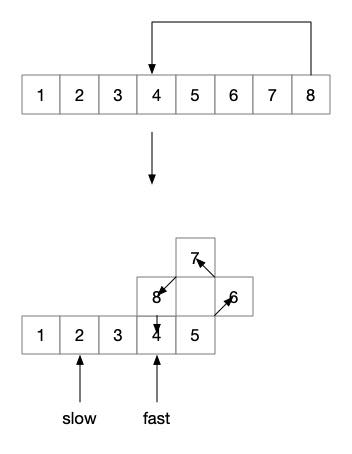

### Question

### Given a linked list, determine if it has a cycle in it.

To represent a cycle in the given linked list, we use an integer `pos` which represents the position (0-indexed) in the linked list where tail connects to. If `pos` is `-1`, then there is no cycle in the linked list.

 

**Example 1:**

```
Input: head = [3,2,0,-4], pos = 1
Output: true
Explanation: There is a cycle in the linked list, where tail connects to the second node.
```


**Example 2:**

```
Input: head = [1,2], pos = 0
Output: true
Explanation: There is a cycle in the linked list, where tail connects to the first node.
```


**Example 3:**

```
Input: head = [1], pos = -1
Output: false
Explanation: There is no cycle in the linked list.
```


### Solution

#### S1:保存已访问结点

如果是一个循环链表，那么必然会重复访问到同一个结点，如果将所有访问过的点保存下来，那么如果再之后的访问过程中，能够访问到已经访问过的结点，则就能判断这个链表是一个循环链表，否则，如果能够访问到空结点，则遇到这个链表的终点，那么它肯定不是循环链表。

```java
public static boolean hasCycle(ListNode head) {
    Set<ListNode> set = new HashSet<>();
    while (head != null) {
        if (set.contains(head)) {
            return true;
        }
        set.add(head);
        head = head.next;
    }
    return false;
}
```

#### S2:双指针追赶法

假设链表是一条路，然后有两个指针（作为两个人），沿着这条路跑，其中一个人跑得较慢，另一个较快，那么有：

1.  如果这不是一条环路，必然是跑得快的人先到达终点
2.  如果这是一条环路，必然会出现跑得慢的人与跑得快的人相遇的一点

这个规律对于链表也是一样，所以可以用来判断一个链表是否是循环链表。我们可以使用两个指针，使两个指针以不同的速度向后移动，如果在未来的某一时刻，两个指针指向了同一个结点，那么这是个循环链表，如果某个指针到达了终点（如果有终点，一定是移动快的指针先到达），那么这就不是一个循环链表。

```java
public static boolean hasCycle(ListNode head) {
    if (head == null || head.next == null) {
        return false;
    }
    ListNode slow = head, fast = head.next;
    while (slow != fast) {
        if (fast == null || fast.next == null) {
            return false;
        }
        slow = slow.next;
        fast = fast.next.next;
    }
    return true;
}
```

如上，slow 指针每次后移一个位置，fast 指针每次后移两个位置，如果这是一个循环链表，那在 fast 指针到达循环段之后，就会一直在这个循环段里面跑，此时 slow 不在循环段里面。



那么当 slow 指针进入循环段的时候，fast 应该在循环段的某个位置。假设循环段中有 n 个结点，当 slow 进入循环段的时候，假设 slow 在循环段中的位置为 1 ，fast 在循环段中的位置为 i ，那么经过多少的时间二者会相遇？即有$(1 + t) \% n = (i + 2t) \% n​$,经过 t 个位移后，两个指针会指向同一个结点。