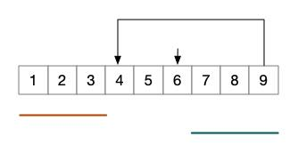

### Question

Given a linked list, return the node where the cycle begins. If there is no cycle, return `null`.

To represent a cycle in the given linked list, we use an integer `pos` which represents the position (0-indexed) in the linked list where tail connects to. If `pos` is `-1`, then there is no cycle in the linked list.

**Note:** Do not modify the linked list.

 

**Example 1:**

```
Input: head = [3,2,0,-4], pos = 1
Output: tail connects to node index 1
Explanation: There is a cycle in the linked list, where tail connects to the second node.
```


**Example 2:**

```
Input: head = [1,2], pos = 0
Output: tail connects to node index 0
Explanation: There is a cycle in the linked list, where tail connects to the first node.
```


**Example 3:**

```
Input: head = [1], pos = -1
Output: no cycle
Explanation: There is no cycle in the linked list.
```


 

**Follow up**:
Can you solve it without using extra space?

### Solution

之前一个题是判断是否有环路，那里使用的方法在本题中同样可以使用。

#### S1:保存已访问结点

将所有已访问的结点保存起来，然后在访问的过程中一旦遇到已访问过的结点，那这个结点一定就是循环段的起始结点。

```java
public static ListNode detectCycle(ListNode head) {
    HashSet<ListNode> set = new HashSet<>();
    while (head != null) {
        if (set.contains(head)) {
            return head;
        } else {
            set.add(head);
            head = head.next;
        }
    }
    return null;
}
```

#### S2:双指针追赶法

如果让两个指针从链表头开始后移，一个指针每次后移一位（跑得慢），一个每次后移两位（跑得快），那么当这两个指针相遇的时候，一则说明这是一个循环链表，二则这跑得快的指针走的路程应该是跑得慢的指针的路径的二倍。


如上，红色和绿色分别是两个指针走的路程，并且绿色长度是红色的两倍。那么化简一下，有如下，红色与绿色相等：


再化简一下：



此时，红色与绿色的长度相等，并且此时两指针相遇在 6 的位置，那么我们看一下，此时的红色长度是不是就是从头结点到开始循环结点的长度，而绿色的长度也正是从相遇结点到开始循环结点的长度，那么如果分别从头结点和相遇结点后移，那么它们最终会相遇在开始循环结点，如此一来，本题的解就求出来了。

当然，也有可能这两个速度不一样的指针不会在第一圈就相遇：如下：


最终化简之后还会是上一张图那样的结果。所以，可以这样求出循环开始结点：

```java
public static ListNode detectCycle(ListNode head) {
    if (head == null || head.next == null)
        return null;
    ListNode slow = head.next, fast = head.next.next;
    while (slow != fast) {
        if (fast == null || fast.next == null)
            return null;
        slow = slow.next;
        fast = fast.next.next;
    }
    while (head != slow) {
        head = head.next;
        slow = slow.next;
    }
    return slow;
}
class ListNode {
    int val;
    ListNode next;
    ListNode(int x) {
        val = x;
        next = null;
    }
}
```

