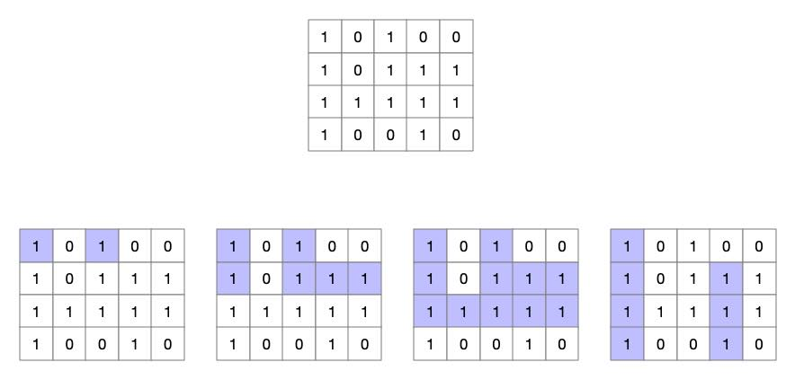

### Question

Given a 2D binary matrix filled with 0's and 1's, find the largest rectangle containing only 1's and return its area.

**Example:**

```
Input:
[
  ["1","0","1","0","0"],
  ["1","0","1","1","1"],
  ["1","1","1","1","1"],
  ["1","0","0","1","0"]
]
Output: 6
```

### Solution

#### S1:扩张法

根据两个限定规则：

1.  所求矩形的第一个坐标点必然是这个二维数组中的某一点，且这一点是`'1'`
2.  所求矩形一定是从一个 1*1 的矩形逐渐扩张而来的

所以，我们可以计算从二维数组中的每个点扩张而成的矩形的面积的最大值，即为待求解。因为已经假定是从某一个点扩张，所以它只能选择向右扩张或向下扩张，然后在每一个递归函数中判断是否能够完成扩张：

```java
private static int max = 0;
public static int maximalRectangle(char[][] matrix) {
    max = 0;
    for (int i = 0; i < matrix.length; i++) {
        for (int j = 0; j < matrix[0].length; j++) {
            if (matrix[i][j] == '1') {
                max = Math.max(max, 1);
                max(matrix, i, j, 1, 1);
            }
        }
    }
    return max;
}
public static void max(char[][] matrix, int i, int j, int w, int h) {
    //right
    if (j+w < matrix[0].length) {
        for (int k = 0; k < h; k++) {
            if (matrix[i+k][j+w] == '0') {
                break;
            }
            if (k == h-1) {
                max = Math.max(max, h * (w + 1));
                max(matrix, i, j, w+1, h);
            }
        }
    }
    //down
    if (i+h < matrix.length) {
        for (int k = 0; k < w; k++) {
            if (matrix[i+h][j+k] == '0') {
                break;
            }
            if (k == w-1) {
                max = Math.max(max, (h + 1) * w);
                max(matrix, i, j, w, h+1);
            }
        }
    }
}
```

这种方法虽然容易理解，但是所需时间较多。

#### S2:计数法

对于这样一个只包含`'0','1'`的二维数组，我们既然要求一个最大的只由`'1'`组成的矩形，那么就需要关注`'1'`连续存在的情况，连续的`'1'`才能组成更大的矩形，并且一旦遇到`'0'`，矩形就必然不能成立了。所以如果将一个矩形作如下变换：

```
1 0 1 0 0		1 0 1 0 0
1 0 1 1 1	->	1 0 1 2 3
1 1 1 1 1		1 2 3 4 5
1 0 0 1 0		1 0 0 1 0
```

即将每一行连续的`'1'`的个数标志出来，那么所有的横向的矩形就解出来了。那么怎么样根据这个计算多行能够合并的最大矩形呢？首先，使用二重遍历遍历到每一个元素，而我们，通过上面的矩阵求出以这个元素结尾的最大的的矩形。那么，对于某一个元素，我们只需要求出高度高度一定的时候宽度的最大值，便可以求出最大的矩形。这时连续的`'1'`的数量就派上用处了，举个例子，对于上面变换过后的坐标`[2,3]`，元素值为 4 ，意味着在这一行（第三行），这个元素前面有 4 个连续的`'1'`，那么当高度为 1 的时候，宽度最大必然就是 4 了，那么当高度为 2 的时候呢？我们看坐标`[2,3]`上面的坐标`[1,3]`值为 2 ，意味着这一层只有 2 个连续的`'1'`，所以，以位置`[2,3]`为矩形的右下角，高度为 2 的时候宽度最大是 2 ，这个矩形的面积就求出来了，当求高度为 3 的矩形面积的时候，再将第一行的数据加上来就行了。当高度逐渐增加，遇到一个`'0'`的时候，意味着这无法构成一个矩形了，就可以结束这一点的求解了。

按照这样的方法，如果我们将每一个点的所有解都求出来，取其最大，必然能够求得最大的那个矩形的面积。代码如下：

```java
public static int maximalRectangle3(char[][] matrix) {
    for (int i = 0; i < matrix.length; i++) {
        for (int j = 1; j < matrix[0].length; j++) {
            if (matrix[i][j] == '1') {
                matrix[i][j] = (char) (matrix[i][j-1] + 1);
            } else {
                matrix[i][j] = '0';
            }
        }
    }
    int max = 0;
    for (int i = 0; i < matrix.length; i++) {
        for (int j = 0; j < matrix[0].length; j++) {
            int min = matrix[i][j] - '0';
            if (min > 0) {
                max = Math.max(max, min);
                for (int k = i-1; k >= 0 && matrix[k][j] != '0'; k--) {
                    min = Math.min(min, matrix[k][j] - '0');
                    max = Math.max(max, min * (i-k+1));
                }
            }
        }
    }
    return max;
}
```

本解法出处见[这里](https://leetcode.com/problems/maximal-rectangle/discuss/218583/DP-solution-faster-than-99.8-w-detailed-description-and-example-O(n)-time-O(1)-space)。

#### S3:按行求解

先看下图：



一个二维数组，可以按行分解成下面四个蓝色标记的图，只要将下面四个蓝色组成的条形图中，能够组成的最大的矩形求出来，那么相对于二维数组的解也就求出来了。而下面四个条形图的问题，其实就是 largest rectangle in histogram 这一题的解，也就是说，本题可以分解成四个小问题，求出四个分问题的解，也就能得到当前问题的解。而在 largest rectangle in histogram 这一问题的求解中使用的所有方法都可以使用在本题的求解中，而 heights 这个数组，就是以二维数组的某一行为底、`'1'`作为连续，`'0'`作为不连续的数组，那么，求出代表每一层的 heights ，再对这个 heights 求解，即可。

如下面的使用分治法求解：

```java
public static int maximalRectangle2(char[][] matrix) {
    if (matrix == null || matrix.length == 0 || matrix[0].length == 0)
        return 0;
    int m = matrix.length, n = matrix[0].length;
    int[] heights = new int[n];
    int max = 0;
    for (int i = 0; i < m; i++) {
        for (int j = 0; j < n; j++) {
            if (matrix[i][j] == '1') {
                heights[j]++;
            } else {
                heights[j] = 0;
            }
        }
        max = Math.max(max, largest(heights, 0, n-1));
    }
    return max;
}
public static int largest(int[] heights, int start, int end) {
    if (start > end) return 0;
    if (start == end) return heights[start];
    boolean sorted = true;
    int min = start;
    for (int i = start+1; i <= end; i++) {
        if (heights[i] < heights[i-1]) sorted = false;
        if (heights[i] < heights[min]) min = i;
    }
    if (sorted) {
        int max = heights[start] * (end - start + 1);
        for (int i = start+1; i <= end; i++) {
            max = Math.max(max, heights[i] * (end - i + 1));
        }
        return max;
    }
    return Math.max(Math.max(largest(heights, start, min-1), largest(heights, min+1, end)),
            heights[min] * (end - start + 1));
}
```

再比如下面的使用最宽长度法求解：

```java
public static int maximalRectangle4(char[][] matrix) {
    if (matrix == null || matrix.length == 0 || matrix[0].length == 0)
        return 0;
    int m = matrix.length, n = matrix[0].length;
    int[] left = new int[n], right = new int[n], height = new int[n];
    Arrays.fill(right, n);
    int max = 0;
    for (int i = 0; i < m; i++) {
        int curLeft = 0;
        for (int j = 0; j < n; j++) {
            if (matrix[i][j] == '1') {
                height[j]++;
                left[j] = Math.max(left[j], curLeft);
            } else {
                height[j] = 0;
                left[j] = 0;
                curLeft = j + 1;
            }
        }
        int curRight = n;
        for (int j = n-1; j >= 0; j--) {
            if (matrix[i][j] == '1') {
                right[j] = Math.min(right[j], curRight);
            } else {
                right[j] = n;
                curRight = j;
            }
        }
        for (int j = 0; j < n; j++) {
            max = Math.max(max, (right[j] - left[j]) * height[j]);
        }
    }
    return max;
}
```

