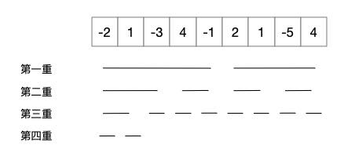

### Question

Given an integer array `nums`, find the contiguous subarray (containing at least one number) which has the largest sum and return its sum.

**Example:**

```
Input: [-2,1,-3,4,-1,2,1,-5,4],
Output: 6
Explanation: [4,-1,2,1] has the largest sum = 6.
```

**Follow up:**

If you have figured out the O(*n*) solution, try coding another solution using the divide and conquer approach, which is more subtle.

### Solution

#### S1:动态规划

对于求子数组和的最大值，一般可采用动态规划，动态规划的话一般需要维护一个数组，以保存每个位置的状态，那么首先要选择要保存的状态，并找出各个位置状态之间的关系。对于这样一个问题，可以取：以当前位置为结尾的子数组和的最大值。那么对于任何一个位置而言，它前面的那部分数组总会有一个最大和，如果将这些和保存在`dp`数组中，有如下关系：

```
dp[i] = Math.max(dp[i-1] + cur, cur)
```

`cur`是当前位置的值。在一次遍历之后，`dp`中就存放了以任何一个位置为结尾的子数组的和的最大值，于是就可以确定要求解就在这个数组中，且必然在这个数组中，因为子数组的结尾必然是原数组中的某个位置。代码如下：

```java
public static int maxSubArray(int[] nums) {
    int n = nums.length;
    if (n == 0) {
        return 0;
    }
    int[] sum = new int[n];
    int max = sum[0] = nums[0];
    for (int i = 1; i < n; i++) {
        if (sum[i-1] > 0) {
            sum[i] = nums[i] + sum[i-1];
        } else {
            sum[i] = nums[i];
        }
        if (sum[i] > max) {
            max = sum[i];
        }
    }
    return max;
}
```

此时时间复杂度和空间复杂度都是$O(n)$。观察上述代码，会发现`dp[i]`的值只与`sum[i]`和`dp[i-1]`的值相关，而且每个`dp[i-1]`在使用了一次之后便不会再使用，那么这个数组所占用的 n 个空间是否浪费了呢？是否能够将这部分空间省下来？确实是可以的，我们只需要额外使用一个值每次保存这个`dp[i-1]`便好了，代码如下：

```java
public static int maxSubArray(int[] nums) {
    int n = nums.length;
    if (n == 0) {
        return 0;
    }
    int max = nums[0];
    int last = nums[0];
    for (int i = 1; i < n; i++) {
        int cur;
        if (last > 0) {
            cur = nums[i] + last;
        } else {
            cur = nums[i];
        }
        if (cur > max) {
            max = cur;
        }
        last = cur;
    }
    return max;
}
```

这时空间复杂度降为$O(1)$。

#### S2:分治法

题目中给了一种使用分治法的思路，那么如何使用分治法解本题？分治法的思想呢，一般就是将原数组一分为二，然后在两个部分中各自求解，最后合并起来，成为原问题的解。而对于本题而言，如果将原本的数组一分为二，所要求的子数组确实有可能在两个部分之间，不过也有可能两个数组各占一点，我们只要考虑到这两种情况，便可以进行解题了：

1.  如果子数组在两侧的某一侧，那么只需要求出以两侧的子数组为基础的各自的子数组的最大和就行了，这个最大和必然也是本题的解
2.  如果子数组在两侧各占一点，那么这个子数组必然是左侧数组的右半部分加上右侧数组的左半部分。那么只要沿着中间的数字向两端延伸，找到一个和最大的子数组就好了

题目的解必然是上述两种情况的一种，所以上述两种情况都求出来之后的最大的解必然是本题的解。代码如下：

```java
public static int maxSubArray(int[] nums) {
    return max(nums, 0, nums.length-1);
}
public static int max(int[] nums, int start, int end) {
    if (start == end) {
        return nums[start];
    }
    int mid = (start + end) / 2;
    int left = max(nums, start, mid);
    int right = max(nums, mid+1, end);
    int maxL, sumL, maxR, sumR;
    maxL = sumL = nums[mid];
    maxR = sumR = nums[mid+1];
    for (int i = mid-1; i >= start; i--) {
        sumL += nums[i];
        maxL = Math.max(sumL, maxL);
    }
    for (int i = mid+2; i <= end; i++) {
        sumR += nums[i];
        maxR = Math.max(sumR, maxR);
    }
    return left > right ? Math.max(left, maxL + maxR) : Math.max(right, maxL + maxR);
}
```

那么本题的时间复杂度应该是多少，是否会优于动态规划的方法？首先，因为使用了分治法，所以必然时间复杂度是 logn 的倍数，对于数组`[-2,1,-3,4,-1,2,1,-5,4]`而言，执行时间为：



如上，第一重循环的时候，需要左向查询`[-2,1,-3,4,-1]`找到左边的最大值，又要右向查询`[2,1,-5,4]`找到右边最大值，所以需要遍历 n 次，同理，第二重也要遍历一个 n ，所以对于二分查找而言，需要查询$\log n​$重，那么这种方法的时间复杂度也就是$O(n\log n)​$。所以，采用这种分治法效率会低于动态查询。