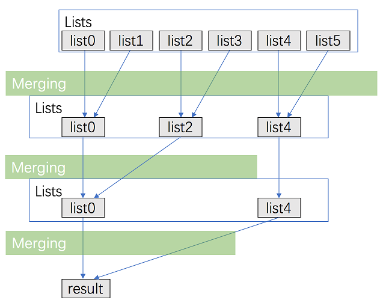

### Question

Merge *k* sorted linked lists and return it as one sorted list. Analyze and describe its complexity.

**Example:**

```
Input:
[
  1->4->5,
  1->3->4,
  2->6
]
Output: 1->1->2->3->4->4->5->6
```

### Solution

之前有过一个题，是合并两个有序链表，而这一题是它的升级版：合并 k 个有序链表。所以首先得到这第一个很通俗的解法。

#### S1:利用合并 2 个有序链表的解法

将本题看作为一个大问题，那么可以做以下分解，将第 1 个与第 2 个链表先合成，然后将这个合成以后的链表再与第 3 个合成，于是便变成了 k-1 个小问题：

```java
public static ListNode mergeTwoLists(ListNode l1, ListNode l2) {
    ListNode head = null, node = null, tmp = null;
    while (l1 != null && l2 != null) {
        if (l1.val > l2.val) {
            tmp = l1;
            l1 = l2;
            l2 = tmp;
        }
        if (head == null) {
            head = l1;
            l1 = l1.next;
            node = head;
        }else {
            node.next = l1;
            l1 = l1.next;
            node = node.next;
        }
    }
    if (l2 != null) {
        l1 = l2;
    }
    if (node != null) {
        node.next = l1;
    }else {
        head = l1;
    }
    return head;
}

public static ListNode mergeKLists(ListNode[] lists) {
    if (lists.length == 0) return null;
    if (list.length == 1) return list[0];
    ListNode head = mergeTwoLists(lists[0], lists[1]);
    for (int i = 2; i < lists.length; i++) {
        head = mergeTwoLists(head, lists[i]);
    }
    return head;
}
```

而这种解法很容易想到它的一种改进版，即下面一种方法。

#### S2:S1改进版

在第一种方法中，原本位于 lists[0] 的链表，在后面的每一个合并中都会参与，但这并不符合最优原理，根据二分合并规则，应该是下面这种合并更加合理：



```java
public static ListNode mergeKLists(ListNode[] lists) {
    if (lists.length == 0) return null;
    int len = lists.length, i = 0;
    while (len > 1) {
        for (int j = 0; j < len; j += 2) {
            if (j + 1 < len) {
                lists[i++] = mergeTwoLists(lists[j], lists[j+1]);
            }else {
                lists[i++] = lists[j];
            }
        }
        len = i;
        i = 0;
    }
    return lists[0];
}
```

如此以来，算法的时间复杂度就变为了$O(n\log k)$。

#### S3:逐个添加法

除了直接利用合并 2 个有序链表之外，也可以借鉴其方法，即每次选取一个值最小的结点加入新的链表中，所以每次都要遍历整个数组以找到最小的那一个，代码如下：

```java
public static ListNode mergeKLists(ListNode[] lists) {
    ListNode head = null, node = null;
    while (true) {
        // find min node
        int min = -1;
        for (int i = 0; i < lists.length; i++) {
            if (lists[i] != null && (min == -1 || lists[min].val > lists[i].val)) {
                min = i;
            }
        }
        if (min == -1) {
            break;
        }
        ListNode minN = lists[min];
        if (head == null) {
            head = minN;
            node = head;
        } else {
            node.next = minN;
            node = node.next;
        }
        lists[min] = minN.next;
    }
    return head;
}
```

这种方法的时间复杂度为$O(nk)$。

#### S4:S3改进版

第三种方法的目的是每次找到当前数组中最小的一个结点，并且每次选取最小的结点加入新的链表中，这么一来就有点类似于利用堆完成排序的过程，本题中也可以采用类似的方法，将整个链表数组看作为一个堆，那么首先将其按照各链表第一个结点的值的大小顺序，进行排序。排序之后，必然有 lists[0] 就是当前要选取的结点，取出之后，再加入这个结点的后继结点，根据堆的特点，只需要 logN 的时间就可以在完成排序，所以这种解法的时间复杂度为$O(n\log k)$。

在解本题的过程中，与堆排序不同的是，待排序的是一个链表数组，而取数据只是取某一链表的头结点，去掉头结点之后的链表还是要原封不动放回数组，并且在此过程中还会遇到某个链表被取空的情况，所以要使用此方法解题需要先解决这两个问题。

对于第一个问题，在堆排序中，我们将最小值与堆的最后一位元素交换，由此得到大小 -1 的待调整堆（只有第一个元素所处位置不对），而在本题中，可以将取出头结点之后的链表放回原处，这是因为这个位置的头结点（也就是取出结点的后继结点）可能并不是最小值，由此便得到大小不变的待调整堆，同样执行调整函数便可得到新的小根堆。

对于第二个问题，由于空链表不会再被取到，所以我们认定，所有的非空链表所对应的值都小于空链表对应的值，也就是说对于一个小根堆而言，空链表永远不会位于第一个位置，除非数组中只剩下空链表，由此也得到了循环结束的条件，如果连第一个位置的链表都为空的话，就意味着所有的链表肯定都是空了。

当这两个问题解决之后，便可以完成具体的算法：

```java
//小根堆调整
public static void heapAdjust(ListNode[] list, int start, int end, Comparator<ListNode> com) {
    ListNode n = list[start];
    for (int i = 2 * start + 1; i <= end; i = i * 2 + 1) {
        if (i < end && com.compare(list[i], list[i+1]) > 0) {
            i ++;
        }
        if (com.compare(n, list[i]) <= 0) {
            break;
        }
        list[start] = list[i];
        start = i;
    }
    list[start] = n;
}
public static ListNode mergeKLists(ListNode[] lists) {
    if (lists.length == 0) {
        return null;
    }
    ListNode head = null, node = null;
    //大小比较规则
    Comparator<ListNode> com = new Comparator<ListNode>() {
        @Override
        public int compare(ListNode o1, ListNode o2) {
            if (o1 == null && o2 == null)
                return 0;
            else if (o1 == null) {
                return 1;
            } else if (o2 == null) {
                return -1;
            } else {
                return o1.val - o2.val;
            }
        }
    };
    //构建小根堆
    for (int i = lists.length / 2; i >= 0; i--) {
        heapAdjust(lists, i, lists.length-1, com);
    }
    //依次取出最小结点，并重新调整
    while (lists[0] != null) {
        ListNode n = lists[0];
        ListNode nn = n.next;
        if (head == null) {
            head = n;
            lists[0] = nn;
            node = head;
        }else {
            node.next = n;
            lists[0] = nn;
            node = node.next;
        }
        heapAdjust(lists, 0, lists.length-1, com);
    }
    return head;
}
```

#### S5:直接排序法

除了上述两种方法之外，题目的要求是：合并 k 各有序数组，而我们上述的几种方法都是一种类型：有序地合并，即在合并的时候始终保持有序地合并，这要求我们需要使用一定的方法找到一个适合的结点依次添加到合并链表中。那么如果换一种思路：先合并再排序，就会得到另一种方法。

具体的过程就是，先将所有的链表的结点都添加到一个数组中，然后对这个数组排序，排序之后再将其按照顺序依次添加到新的链表中，这个链表便是有序的。代码如下：

```java
public static ListNode mergeKLists(ListNode[] lists) {
    List<ListNode> list = new ArrayList<>();
    for (int i = 0; i < lists.length; i++) {
        ListNode n = lists[i];
        while (n != null) {
            list.add(n);
            n = n.next;
        }
    }
    list.sort(new Comparator<ListNode>() {
        @Override
        public int compare(ListNode o1, ListNode o2) {
            return o1.val - o2.val;
        }
    });
    ListNode head = null, node = null;
    for (int i = 0; i < list.size(); i++) {
        if (head == null) {
            head = list.get(i);
            node = head;
        }else {
            node.next = list.get(i);
            node = node.next;
        }
    }
    return head;
}
```

这时算法的时间复杂度便成了这个排序算法的时间复杂度，最好可达到$O(n\log n)$。

