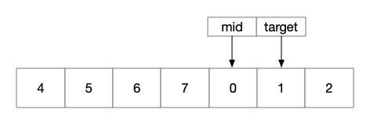

### Question

Suppose an array sorted in ascending order is rotated at some pivot unknown to you beforehand.

(i.e., `[0,1,2,4,5,6,7]` might become `[4,5,6,7,0,1,2]`).

You are given a target value to search. If found in the array return its index, otherwise return `-1`.

You may assume no duplicate exists in the array.

Your algorithm's runtime complexity must be in the order of *O*(log *n*).

**Example 1:**

```
Input: nums = [4,5,6,7,0,1,2], target = 0
Output: 4
```

**Example 2:**

```
Input: nums = [4,5,6,7,0,1,2], target = 3
Output: -1
```

### Solution

#### S1:扩展二分法

由题目可知，该有序数组满足以下条件：

1.  分为左右两部分，且各是一个递增有序数组
2.  右部的最大值小于左部的最小值

一般来说我们在一个有序数组上进行查找，可以使用二分法，那么对于这样一个数组是否也可以使用二分法查找呢，先来分析一下。使用二分查找的要义，是每次将待查找数组划分为两部分，并且能够正确地选择待查找值所在的那一部分进行下一部查找。在二分查找中用以划分数组的一般是数组的中间值，假设为 mid ，那么对于一种查找情况，需要知道的条件有：

1.  待查找值在左部还是右部

    这个比较好比较，只需要将待查找值与数组的第一个数比较就好，若大于第一个数，则在左部，否则在右部。

2.  mid 值在左部还是右部

    同上，与第一个数比较。

3.  待查找值与 mid 的大小关系

待查找值所在的位置（相对于 mid 的位置）是可以通过以上三种关系确定的。共有五种关系：

1.  target 在左部，mid 在左部，target > mid

    

    此时，target 在 mid 的右侧

2.  target 在左部，mid 在左部，target < mid

    

    此时，target 在 mid 的左侧

3.  target 在左部，mid 在右部

    

    此时，target 在 mid 的左侧

4.  target 在右部，mid 在右部，target > mid

    

    此时，target 在 mid 的右侧

5.  target 在右部，mid 在右部，target < mid

    

    此时，target 在 mid 的左侧

6.  target 在右部，mid 在左部

    

    此时，target 在 mid 的右侧

与有序数组的二分查找相比，仅仅是从 2 种情况变为了 6 种情况，其二分查找的性质是没有变的。代码如下：

```java
public static int search(int[] nums, int target) {
    if (nums.length == 0) {
        return -1;
    }
    int start = 0, end = nums.length-1, mid, m;
    int first = nums[0];
    boolean left = target >= first;
    while (start < nums.length && end > -1 && start <= end) {
        mid = (start + end) / 2;
        m = nums[mid];
        if (m == target) {
            return mid;
        }
        if (m >= first) {
            if (m > target) {
                if (left) {
                    end = mid - 1;
                } else {
                    start = mid + 1;
                }
            } else {
                start = mid + 1;
            }
        } else {
            if (m > target) {
                end = mid - 1;
            } else {
                if (left) {
                    end = mid - 1;
                } else {
                    start = mid + 1;
                }
            }
        }
    }
    return -1;
}
```

#### S2:直接利用二分法

除了使用上述多条件二分之外，因为所给数组两个部分分别是有序的，所以另一种方法是先求出这两部分的分界点，然后根据待查找值的大小，分别在左部或右部进行二分查找，则这种方法解题的关键是如何找到两部分的分界点。

分界点的查找也是可以使用二分法完成的，可以根据 mid 在左部或者右部来判断：

1.  若 mid-1 所在值大于 mid ，那么 mid 便是左右部的分界点，其他情况讨论如下，
2.  若 mid 在左部，则分界点在 mid 右侧
3.  若 mid 在右部，则分界点在 mid 左侧

如此便可以在$O(\log n)$的时间内找到分界点，然后只需要在单独一部分进行二分查找就行了。代码如下：

```java
int [] nums;
int target;
public int find_rotate_index(int left, int right) {
    if (nums[left] < nums[right])
        return 0;
    while (left <= right) {
        int pivot = (left + right) / 2;
        if (nums[pivot] > nums[pivot + 1])
            return pivot + 1;
        else {
            if (nums[pivot] < nums[left])
                right = pivot - 1;
            else
                left = pivot + 1;
        }
    }
    return 0;
}
public int search(int left, int right) {
/*
Binary search
*/
    while (left <= right) {
        int pivot = (left + right) / 2;
        if (nums[pivot] == target)
            return pivot;
        else {
            if (target < nums[pivot])
                right = pivot - 1;
            else
                left = pivot + 1;
        }
    }
    return -1;
}
public int search(int[] nums, int target) {
    this.nums = nums;
    this.target = target;
    int n = nums.length;
    if (n == 0)
        return -1;
    if (n == 1)
        return this.nums[0] == target ? 0 : -1;
    int rotate_index = find_rotate_index(0, n - 1);
    // if target is the smallest element
    if (nums[rotate_index] == target)
        return rotate_index;
    // if array is not rotated, search in the entire array
    if (rotate_index == 0)
        return search(0, n - 1);
    if (target < nums[0])
        // search in the right side
        return search(rotate_index, n - 1);
    // search in the left side
    return search(0, rotate_index);
}
```

