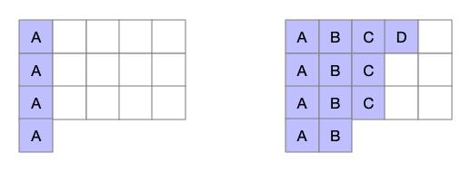
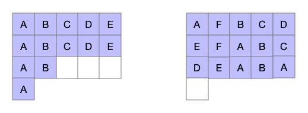

### Question

Given a char array representing tasks CPU need to do. It contains capital letters A to Z where different letters represent different tasks. Tasks could be done without original order. Each task could be done in one interval. For each interval, CPU could finish one task or just be idle.

However, there is a non-negative cooling interval **n** that means between two **same tasks**, there must be at least n intervals that CPU are doing different tasks or just be idle.

You need to return the **least** number of intervals the CPU will take to finish all the given tasks.

 

**Example:**

```
Input: tasks = ["A","A","A","B","B","B"], n = 2
Output: 8
Explanation: A -> B -> idle -> A -> B -> idle -> A -> B.
```

 

**Note:**

1.  The number of tasks is in the range [1, 10000].
2.  The integer n is in the range [0, 100].

### Solution

#### S1:选择法-递归

第一种递归方法，最好理解也最麻烦，题目的意思是每次在 tasks 中选择一个任务或者直接空闲，然后下一个时间片再选择一个任务（或空），以此下去，求能将所有任务执行完使用的最少时间片，所以可以使用一个递归：

```java
private static int result;
public static int leastInterval(char[] tasks, int n) {
    int[] nums = new int[26];
    int[] last = new int[26];
    for (char c : tasks) nums[c - 'A']++;
    Arrays.fill(last, -n-1);
    result = Integer.MAX_VALUE;
    least(n, nums, last, 0, tasks.length);
    return result;
}
private static void least(int n, int[] nums, int[] last, int pos, int cur) {
    if (pos >= result) {
        return;
    }
    if (cur == 0) {
        result = Math.min(result, pos);
    }
    for (int i = 0; i < 26; i++) {
        if (nums[i] > 0 && pos - last[i] > n) {
            int l = last[i];
            last[i] = pos;
            nums[i]--;
            least(n, nums, last, pos+1, cur-1);
            last[i] = l;
            nums[i]++;
        }
    }
    least(n, nums, last, pos+1, cur);
}
```

递归函数中先在任务中选择，都不行的话就直接空闲。

#### S2:选择法-排序

在一个数组中，如果可能出现冲突的话，一定是出现次数最多的那个任务最容易出现与上次执行间隔小于 n 的情况，所以，在执行任务的时候，应该先执行次数最多的那个任务，然后执行次数第二多的任务，这样执行的话，可以将所有的任务都执行一次，但是为了将任务合理分配，应该每次最多只执行 n+1 个任务。如对于任务`[A, A, A, A, B, C]`，最短间隔时间 1 ，我们可以选择第一轮执行`[A, B, C]`，也可以选择第一轮只执行两个任务`[A, B]`，这样做的好处是，当我们执行第二轮的时候，还可以执行`[A, C]`，但是如果像前者那样执行，就会出现第二轮只能选择`[A, null]`这种执行方式了，然后第三轮接着按照`[A, null]`执行。在这种情况中我们看到，如果采用前者，C 任务的执行时间没有消失，但是却增加了一个空闲时间，而采用后者的话，C 的执行时间放在了本该空闲的地方，这就增加了执行任务的效率。代码如下：

```java
public static int leastInterval2(char[] tasks, int n) {
    int[] nums = new int[26];
    for (char c : tasks) {
        nums[c-'A']++;
    }
    Arrays.sort(nums);
    int pos = 0;
    while (nums[25] > 0) {
        int i = 25;
        while (i >= 0 && 25 - i <= n && nums[i] > 0) {
            nums[i]--;
            i--;
            pos++;
        }
        if (nums[25] != 0) {
            pos += Math.max(0, n-24+i);
        }
        Arrays.sort(nums);
    }
    return pos;
}
```

这里的第一层 while 循环判断了是否还有任务，第二层 while 选择了当前这一轮应该执行的任务。

#### S3:求空闲时间片

对于执行一串任务，所需的时间片是任务数加上空间时间片数，那么求出执行这些任务所需的空间时间片即可。如果任务列表中只有一个任务，那么每执行完这个任务，只能在 n 个空闲时间片之后接着执行这个任务，如任务列表`[A,A,A,A]`，时间间隔 2 ，那么此时执行完这些任务就需要 10 个时间片，即 4 + 3 \* 2 ，即包括 4 个执行任务时间片和 6 个空闲时间片，因为除了最后一个任务之外，每执行一个任务就需要 2 个空间时间片，即空闲时间片为`(任务数量-1) * n`。

对于一个多任务的也是类似的，此时最大的空闲时间片应该是`(最多的那一个任务数量-1) * n`,如下图：



对于一个任务列表`[A, A, A, A, B, B, B, B, C, C, C, D]`，时间间隔为 4 而言，这里最多的任务数是 4 ，那么此时最大的空闲时间片应该是 3*4 ，那么按照出现次数的顺序，逐步使用剩余的任务将待定空闲片补全即可，如上图右，依次使用 B C D 填充对应的空闲片，那么当剩余的任务都填充完了之后，此时的空闲时间片就是执行这些任务真正所需的空闲时间片。（执行任务的顺序为从左到右，从上到下）

另外，当任务的种类数大于 n+1 时，会出现到最后有的任务没有位置的情况（上图中任务种类数为 4，n=4，所以对于每一行的长度为 5 来说，并不会出现没有位置的情况），如任务列表`[A, A, A, A, B, B, B, C, C, D, D, E, E, F, F]`，时间间隔为 4 ，那么当按序填充到 E 的时候，所有列就都有任务了，如下左：



这是随便将其添加到哪一行都行，只需要将这个位置原本的任务依次后移一位即可，如上右，即便是在没有空列的情况下添加了两个 F 任务，仍然消去了两个空闲时间片，也就是说，无论有多少个元素，都可以直接使用其消去空闲时间片。

或者当任务数再多一点，即当`任务列表中的任务数 > (出现次数最多的任务数-1) * n + 1`的时候，待定空闲片已经被全部填充，但仍有未填充的任务，那么就意味着空闲时间片为 0 ，而执行这些任务所需的时间片就是任务的数量。代码如下：

```java
public static int leastInterval(char[] tasks, int n) {
    int[] nums = new int[26];
    for (char c : tasks) {
        nums[c-'A']++;
    }
    Arrays.sort(nums);
    int max = nums[25]-1, idle = max * n;
    for (int i = 24; i >= 0 && nums[i] > 0 && idle > 0; i--) {
        idle -= Math.min(max, nums[i]);
    }
    return idle > 0 ? idle + tasks.length : tasks.length;
}
```

或者也可以换一种写法（无需排序，只需要找到出现次数最多的任务，以及它的出现次数即可）：

```java
public static int leastInterval(char[] tasks, int n) {
    int max = 0, count = 0;
    int[] nums = new int[26];
    for (char c : tasks) {
        nums[c-'A']++;
        if (max == nums[c-'A']) {
            count++;
        } else if (nums[c-'A'] > max){
            max = nums[c-'A'];
            count = 1;
        }
    }
    return Math.max(tasks.length, (max-1) * (n+1) + count);
}
```

这与上面是同样的原理，只不过是换一种计算方法。