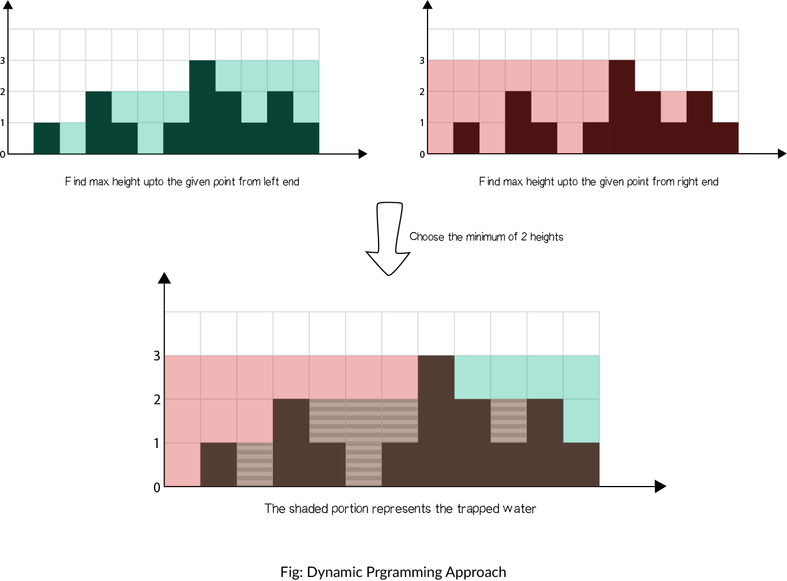
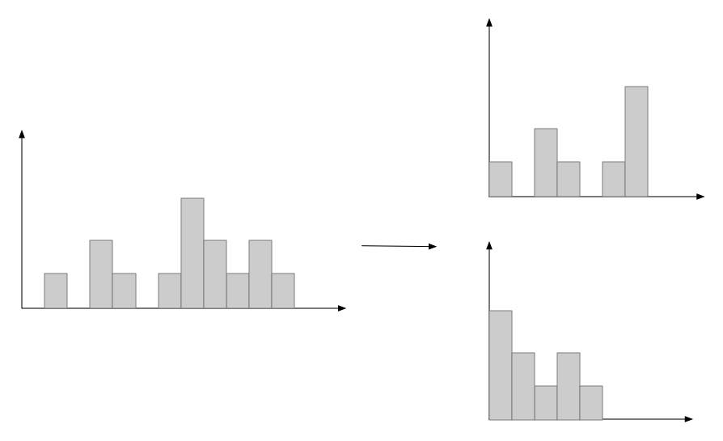
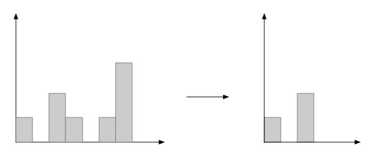
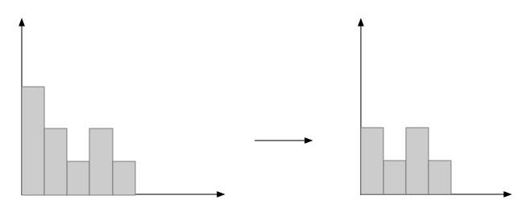
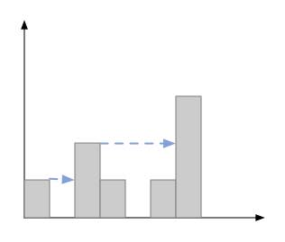
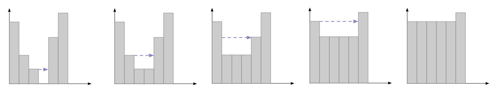

### Question

Given *n* non-negative integers representing an elevation map where the width of each bar is 1, compute how much water it is able to trap after raining.


The above elevation map is represented by array [0,1,0,2,1,0,1,3,2,1,2,1]. In this case, 6 units of rain water (blue section) are being trapped. **Thanks Marcos** for contributing this image!

**Example:**

```
Input: [0,1,0,2,1,0,1,3,2,1,2,1]
Output: 6
```

### Solution

#### S1:几何法

如果将所给的数组都画成如题所给的那种图形，那么就是已知黑色的图形，求蓝色图形的面积，利用几何的特点，可以加一些辅助线，如下：



很容易看出有关系式：$\text{绿色图形面积} + \text{红色图形面积} - \text{整个矩形面积} - \text{黑色图形面积} = \text{灰色图形面积}$，其中，红色和绿色以及黑色的那块图形面积只需要遍历一次数组便可以得到，而矩形的面积，就是数组中最大元素的值与矩形大小的乘积，代码如下：

```java
public static int trap(int[] height) {
    int left = 0, right = 0, max = 0, block = 0;
    int maxR = 0;
    for (int i = 0; i < height.length; i++) {
        block += height[i];
        if (height[i] > maxR) {
            right += (height[i] - maxR) * (height.length - i);
            maxR = height[i];
        }
        if (height[i] > max) {
            max = height[i];
        }
    }
    int maxL = 0;
    for (int i = height.length-1; i >= 0; i--) {
        if (height[i] > maxL) {
            left += (height[i] - maxL) * (i + 1);
            maxL = height[i];
        }
    }
    return left + right - max * height.length - block;
}
```

#### S2:收缩法

在所给的数组中，必然存在一个最大的元素，将整个数组分成两半，如下：



此时两个分散的小图所能蓄到的水的量与大图是相等的，所以可以转而去求两个小图的解。以上面的小图为例，又可以将其以第二大的数分割成两部分，如下：



对于右部的图而言，因为第一与第二大的数分别在两端，所以它所能蓄的水必然等于第二大的数与中间各数的差值，同理，对于左部的图也可以这么求，这样一来，就求出一部分的解了。那么对于第一张图下面的那个小图而言，它如果根据第二大的数分割，可以得到：



因为左部仅有两个数，故不能蓄水，那么仅需要讨论右部，而观察右部，又可以根据中间的最大的值分割，然后再求出来蓄水量，当这些都求出来之后，便可以得到最后的解。

但是再实际求解的过程中，每次求第二大的数并不容易，但是如果换种思路，如果从两侧向中间收缩，最终收缩到最大值，那么在收缩的过程中，每次遇到的数都会小于最大值，对于左边的收缩部分来说，所有的数都会小于右边界的值，那么对于左部中间的每一个数来说，当前位置的蓄水高度必然就等于它左边的最大值：



右侧收缩同理：

```java
public static int trap(int[] height) {
    int trap = 0, maxL = 0, maxR = 0, left = 0, right = height.length-1;
    while (left < right) {
        if (height[left] < height[right]) {
            if (height[left] > maxL) {
                maxL = height[left];
            } else {
                trap += maxL - height[left];
            }
            left++;
        } else {
            if (height[right] > maxR) {
                maxR = height[right];
            } else {
                trap += maxR - height[right];
            }
            right--;
        }
    }
    return trap;
}
```

这样就可以在一次遍历求解。

#### S3:填充法

题目所求能够蓄水的数量，也可以认为是为了填补这个图形所需要的面积，即填补该图形中所有的凹槽，使其变成平的，下面是填补的一种方法：从第一个数字开始扫描，每扫描到一个凹槽，便填充这个凹槽，并记下填充的面积，如下：



上图是数组`[4,2,1,3,5]`的填充过程，箭头的位置就是当前扫描到的数组的位置，每一步都会填充一个凹槽，直到最后整个图形没有凹槽才会结束，大致过程就是，从某一个位置依次向前扫描，遇到凹槽就填充，直到遇到比自己大的数为止。然后再后移一位判断下一位。可见这个过程是一层一层填充，而不是像之前的方式那样以格为单位。实际使用的时候需要使用到栈来保存之前的状态，算法如下：

```java
public static int trap(int[] height) {
    int trap = 0, cur = 0;
    Stack<Integer> stack = new Stack<>();
    while (cur < height.length) {
        while (!stack.empty() && height[cur] > height[stack.peek()]) {
            int top = stack.pop();
            if (stack.empty()) {
                break;
            }
            if (height[stack.peek()] == height[top]) {
                continue;
            }
            int dis = cur - stack.peek() - 1;
            int h = Math.min(height[cur], height[stack.peek()]) - height[top];
            trap += dis * h;
        }
        stack.push(cur++);
    }
    return trap;
}
```

这种方法虽然也是一次遍历，但是在遍历的过程中要不断地前向判断，而且有用到栈，所以效率的话，相比之前的还是差点。