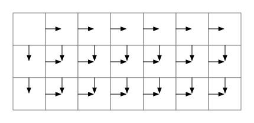

## Question

A robot is located at the top-left corner of a *m* x *n* grid (marked 'Start' in the diagram below).

The robot can only move either down or right at any point in time. The robot is trying to reach the bottom-right corner of the grid (marked 'Finish' in the diagram below).

How many possible unique paths are there?


Above is a 7 x 3 grid. How many possible unique paths are there?

**Note:** *m* and *n* will be at most 100.

**Example 1:**

```
Input: m = 3, n = 2
Output: 3
Explanation:
From the top-left corner, there are a total of 3 ways to reach the bottom-right corner:
1. Right -> Right -> Down
2. Right -> Down -> Right
3. Down -> Right -> Right
```

**Example 2:**

```
Input: m = 7, n = 3
Output: 28
```

## Solution

### S1:递归法

要求从某一点`[i,j]`到点`[m,n]`所有的路径，且只能向右或向下，那么自然所有的路径数必然是向下之后剩余的路径数加上向右之后的路径数，即`[i,j] = [i+1,j] + [i,j+1]`，并且有`[m,n]`到自身的路径只有一条，那么便可列出如下递归式：

```java
public static int max(int m, int n, int i, int j) {
    if (i == m && j == n) {
        return 1;
    } else if (i == m) {
        return max(m, n, i, j+1);
    } else if (j == n) {
        return max(m, n, i+1, j);
    } else {
        return max(m, n, i+1, j) + max(m, n, i, j+1);
    }
}

public static int uniquePaths(int m, int n) {
    return max(m, n, 1, 1);
}
```

但是这种方法运行超时了，不过不用运行也知道，实在是有太多的重复计算了。不过对于这个 m\*n 的数组来说，它最多也就是有 m\*n 中不同的值，所以我们可以使用一个数组保存已经计算过的某点的解，那么就不需要重复计算了：

```java
public static int uniquePaths(int m, int n) {
    int[][] saved = new int[m][n];
    for (int i = 0; i < m; i++) {
        Arrays.fill(saved[i], -1);
    }
    saved[m-1][n-1] = 1;
    return max(m, n, 0, 0, saved);
}
public static int max(int m, int n, int i, int j, int[][] saved) {
    int result;
    if (saved[i][j] > 0) {
        return saved[i][j];
    }
    if (i == m-1 && j == n-1) {
        result = 1;
    } else if (i == m-1) {
        result = max(m, n, i, j+1, saved);
    } else if (j == n-1) {
        result = max(m, n, i+1, j, saved);
    } else {
        result = max(m, n, i+1, j, saved) + max(m, n, i, j+1, saved);
    }
    saved[i][j] = result;
    return result;

```

### S2:动态规划法

对于这样一个 m*n 的数组，是否有时间复杂度为$O(mn)$的算法？首先分析，对于任何一个位置而言，必然都有一个从原点到这个位置的路径数，而且它有这样的计算方法：`[1,1]`到`[i,j]`点存在的路径数，等于`[1,1]->[i-1,j]`与`[1,1]->[i,j-1]`的路径数之和。因为只能向右或向下，所以只有两种方法能到达位置`[i,j]`：从上一位置`[i-1,j]`向下，`[i,j-1]`向右。于是得到了某一点的计算式：

```
[i,j] = [i-1,j] + [i,j-1]
```

所以有下图：



代码为：

```java
public static int uniquePaths(int m, int n) {
    int[][] paths = new int[m][n];
    Arrays.fill(paths[0], 1);
    for (int i = 1; i < m; i++) {
        paths[i][0] = 1;
    }
    for (int i = 1; i < m; i++) {
        for (int j = 1; j < n; j++) {
            paths[i][j] = paths[i-1][j] + paths[i][j-1];
        }
    }
    return paths[m-1][n-1];
}
```

这时时间复杂度为$O(mn)$，空间复杂度也为$O(mn)$。不过观察上图的递推规律，发现如果按行来计算的话，计算每一行的路径数仅需要知道上一行的路径数即可，那么是否可以只保存上一行的路径数，使得空间复杂度变为$O(n)$，看下面的代码：

```java
public static int uniquePaths3(int m, int n) {
    if (m < n) {
        int tmp = m;
        m = n;
        n = tmp;
    }
    int[] pre = new int[n];
    Arrays.fill(pre, 1);
    for (int i = 1; i < m; i++) {
        for (int j = 1; j < n; j++) {
            pre[j] = pre[j] + pre[j-1];
        }
    }
    return pre[n-1];
}
```

### S3:数学公式法

对于一个 m*n 的数组，时间复杂度为$O(mn)$的算法似乎就是这个问题的终结了，上面的那种算法也确实达到了 beat 100%，不过我还是看到了一种更加清新的解法。

首先，要使`[1,1]`移动到`[m,n]`，且只能是向右或向下，必然需要 m-1 次向下移动和 n-1 次向右移动，所谓的不同路径，只是向右向下移动的顺序不同而已，如要从`[1,1]`移动到`[2,3]`，移动路径可以是`DRR`，也可以是`RDR`或`RRD`，也确实只是顺序有所不同。于是这样一个问题就变成了，m-1 个 D 和 n-1 个 R 能够组合成多少种不同的组合。即$C_{m+n-2}^{n-1} = C_{m+n-2}^{m-1} = \frac{(m+n-2)!}{(n-1)!(m-1)!} = \frac{(m+n-2)(m+n-3)\dots(m)}{(n-1)!}$，于是有代码：

```java
public static int uniquePaths4(int m, int n) {
    if (m == 0 || n == 0) return 0;
    if (m == 1 || n == 1) return 1;
    if (m < n) {
        int tmp = m;
        m = n;
        n = tmp;
    }
    long paths = 1;
    for (int i = 1; i < n; i++) {
        paths *= m + n - i -1;
        paths /= i;
    }
    return (int) paths;
}
```

此时时间复杂度为$O(n)$，空间复杂度为$O(1)$。